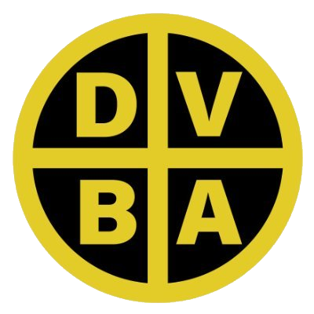

# Guía Visual Complementaria

> Contenido original de la guía visual (versión resumida con capturas), útil como referencia rápida complementaria a las notas detalladas: [02-Primeros-pasos](02-Primeros-pasos.md), [07-App-Movil-Modo-Basico](07-App-Movil-Modo-Basico.md), [08-App-Movil-Modo-Avanzado](08-App-Movil-Modo-Avanzado.md), [13-Modo-Offline](13-Modo-Offline.md), [14-FAQ](14-FAQ.md).

## Instalar la app en el celular (PWA)

La app se instala como cualquier otra del celular, pero **sin pasar por Play Store o App Store**. El proceso toma 30 segundos:

  

    

      
SIG Vial PBA

      

        

          
📥

          
Instalar SIG Vial PBA

          
Agregar a la pantalla de inicio

          

            
Cancelar

            
Instalar

          

        

      

    

  

**Paso a paso**

1. Abrir **Chrome** en el celular.
2. Ir a `lemeit.github.io/DVBA/app.html` (importante: el `/app.html` al final, sino se abre el portal escritorio).
3. Al abrir aparece un banner, o el menú `⋮` muestra la opción **Instalar aplicación**.
4. Tocarla y aceptar. Se agrega el ícono al launcher del celular.
5. A partir de ahí, abrís la app tocando el ícono como cualquier otra.

<strong>El ícono se llama "SIG Vial PBA"</strong> y aparece con el logo institucional DVBA.

### Actualizaciones automáticas

Cuando hay una versión nueva del sistema, al abrir la app aparece un banner verde arriba:

  

    

      

        
🔄

        
<b>Hay una versión más nueva</b><small>Tocá Actualizar</small>

        
Actualizar

      

      

        

          

          
SIG Vial PBA · Modo Básico👷 Técnico · Zona VI

        

        
±8m · 65m

      

      

📸

Sacar foto

y guardar ubicación

    

  

**Cómo actualizar**

1. Al abrir la app, si hay versión nueva aparece el banner verde arriba.
2. Tocar **Actualizar**.
3. La app se recarga con la versión nueva en menos de 2 segundos.

<strong>Importante</strong> · Si no tocás Actualizar, la app va a seguir funcionando con la versión vieja cacheada. No perdés nada, pero no tenés los últimos cambios.

## Sincronización con la oficina

Todo lo que se carga desde el celular aparece automáticamente en el sistema de escritorio, sin que nadie tenga que hacer nada manual:

  

    
📱

    
App celular

    
Saca la foto con GPS y la guarda en cola local

  

  
→

  

    
☁

    
Supabase

    
Sube automáticamente cuando hay conexión

  

  
→

  

    
🖥

    
Portal escritorio

    
Aparece en el mapa, lista para aprobar

  

### Qué ve el personal de oficina

Cuando el técnico de campo envía una foto, en el portal (abierto en la computadora de oficina o cualquier notebook con conexión) aparece:

- Un **pin nuevo en el mapa**, en la posición GPS exacta donde se sacó la foto.
- Un registro en la **cola de aprobación** con estado *"campo"* (a la espera de revisión).
- La foto cruda **sin sello** (el sello institucional se aplica al aprobar).

Desde escritorio, el personal responsable revisa, completa datos y aprueba. La foto queda sellada con los datos definitivos y trazable con QR de Google Maps.

<strong>🔒 Seguridad</strong> · Todos los registros llevan el ID del usuario que los cargó. Cada zona de la DVBA solo ve sus propios datos (excepto Gerencia y Admin, que ven todo).

## Navegador vs app instalada · WiFi/datos vs GPS

**🌐 Desde el navegador (sin instalar)**

Si abrís la URL directamente en Chrome sin instalar la app:

- Necesitás **obligatoriamente** WiFi o datos móviles para que la app cargue.
- Si se corta la conexión, se pierde todo lo que estabas haciendo.
- No hay cola offline: cada foto necesita internet en el momento.

**Uso recomendado**: prueba rápida, primera vez, o desde la computadora de oficina.

**📱 Como app instalada (PWA)**

Una vez que instalaste la app y te logueaste al menos una vez con internet:

- **NO requiere WiFi ni datos** para funcionar.
- Solo necesita **señal de GPS** del celular (que funciona incluso sin internet).
- Guarda las fotos en una cola local.
- Sincroniza automáticamente cuando vuelva la conexión.

**Uso recomendado**: campo, zonas rurales, cualquier situación operativa.

<strong>💡 Regla práctica</strong> · Instalá la app la primera vez que tengas WiFi (en la oficina). Después usala en el campo sin importar si tenés señal — el GPS funciona en cualquier lado. Cuando volvés a la oficina o entrás en zona con señal, todo se sincroniza solo.

## Uso del Modo Básico

Es la app **por default** al instalar. Está pensada para operarios que necesitan solo sacar fotos con GPS, sin cargar formularios largos. Todos los demás datos los completa alguien en la oficina.

### Primera vez que la abrís · Ingresar

  

    

      

        

          

          
SIG Vial PBA · Modo Básico👷 Técnico · Zona VI

        

        
Ubicando…

      

      

        

          
🔐

          <h3>Ingresar</h3>
          
Ingresá con tu cuenta para poder enviar registros.

          <input type="text" placeholder="Correo">
          <input type="password" placeholder="Contraseña">
          
Ingresar

          
O usá la Modo Avanzado.

        

      

    

  

#### Instrucciones

1. Ingresá con el correo y contraseña que te asignó el administrador.
2. La primera vez **necesitás WiFi o datos** para que la app valide tu identidad con el servidor.
3. Una vez logueado, la app te recuerda por tiempo indefinido. Podés cerrar y abrir sin volver a poner clave.

!!! tip "💡 ¿No tenés usuario?"
    Contactá al administrador del sistema: [admin.zonavi@vialidad.gba.gov.ar](mailto:admin.zonavi@vialidad.gba.gov.ar). Te van a dar de alta con tu correo institucional.

!!! info "📱 Multi-zona"
    La app es la misma para todas las zonas DVBA (I a XII). Una vez logueado, el header muestra tu **rol** y **zona** real (ej. `👷 Técnico · Zona IV`). El sistema aplica automáticamente las políticas de la zona asignada — solo ves y cargás datos de tu área.

### Verificar el GPS antes de sacar fotos

  

    

      

        

          

          
SIG Vial PBA · Modo Básico👷 Técnico · Zona VI

        

        
Sin ubicación · tocar

      

      

        

📸

Sacar foto

y guardar ubicación

        
⚠ La ubicación no está lista. <b>Tocá el indicador de arriba</b> para intentar de nuevo.

      

      

        
📤Sin enviar

        
⚙Modo Avanzado

        
ℹInfo

      

    

  

#### Instrucciones

1. El **banner del GPS** al pie del header cambia de color según el estado:
        
🟢 **Verde · ±Nm** · GPS OK, podés sacar fotos.
🟡 **Amarillo · Ubicando…** · Está buscando señal.
🔴 **Rojo · Sin ubicación** · No hay señal. Tocá para reintentar o abrir ajustes.

2. Mientras el GPS esté en rojo, el botón central queda deshabilitado.

3. Si estás en zona sin buena señal, movete al aire libre y esperá 30 segundos.

### Sacar y enviar una foto

  

    

      

        

          

          
SIG Vial PBA · Modo Básico👷 Técnico · Zona VI

        

        
±6m · 78m

      

      

        

📸

Sacar foto

y guardar ubicación

        
Solo tocá el botón para <b>sacar la foto</b> y guardar el <b>lugar exacto</b>.  Los demás datos los completa <b>alguien en la oficina</b>.

      

      

        
📤Sin enviar

        
⚙Modo Avanzado

        
ℹInfo

      

    

  

  

    

      

        

🛣

        
📍 <b>Lat -35.641234   Long -59.784567</b> ±6m · 78m alt · 19/07/2026, 08:45

        

          
↺ Sacar otra

          
✓ Enviar

        

      

    

  

#### Instrucciones

1. Con el GPS en verde, tocá el **botón grande "Sacar foto"**.

2. Se abre la cámara del celular. Sacá la foto.

3. Aparece el **preview** con la foto y sus coordenadas.

4. Si te gustó → **✓ Enviar**. Si querés otra → **↺ Sacar otra**.

5. Al enviar, la foto queda en la cola local. Si hay internet, se sube al toque. Si no, queda esperando.

Feedback visual

· Después de tocar Enviar, aparece un panel con el resultado: ✓ subida OK, 📴 sin conexión (queda en cola), ✗ error. Te dice cuántas fotos hay sin enviar en el celular.

### Ver y gestionar los pendientes

  

    

      

        

Fotos sin enviar3 pendientes

      

      

        

          
🛣

          

19/07 08:45

-35.6412, -59.7846

          
Borrar

        

        

          
🛣

          

19/07 09:02

-35.6398, -59.7889

⚠ Sin ubicación GPS

          
Borrar

        

      

      

        
Borrar todo

        
↻ Enviar ahora

      

    

  

#### Instrucciones

1. Tocá **📤 Sin enviar** en el footer.

2. Aparece la lista de fotos que quedaron en cola local.

3. Cada foto muestra: miniatura, fecha, coordenadas y un aviso si falta GPS.

4. Botón **Borrar** por cada foto (por si quedó rota o sin GPS y no querés que se envíe).

5. Botón **↻ Enviar ahora** reintenta la sincronización si hay internet.

### Panel de información y cerrar sesión

  

    

      

        

SIG Vial PBA · Modo Básico👷 Técnico · Zona VI

      

      

        

          
ℹ

          <h3 style="margin-bottom:10px">Información</h3>
          

            <b>SIG Vial PBA · Modo Básico</b> 
            Versión <b>vX.YZ</b>
            

            <b>Sesión</b> 
            <b>👷 Técnico · Zona VI</b> 
            tecnico.zonavi@vialidad.gba.gov.ar 
            🟢 Con internet 
            📤 Sin enviar: <b>0</b>
          

          

            
Cerrar

            
Cerrar sesión

          

        

      

    

  

#### Instrucciones

1. Tocá **ℹ Info** en el footer.
2. Aparece un panel con:
    - Nombre y versión de la app.
    - Sesión activa (correo del usuario).
    - Estado de conexión (🟢 con internet / 🔴 sin internet).
    - Cantidad de fotos sin enviar.
3. Botón **Cerrar sesión** · si hay pendientes te avisa que se van a perder. Doble confirmación antes de proceder.

## Uso del Modo Avanzado

Es la app tradicional con wizard completo. Se accede desde el link **⚙ App completa** del footer de la lite o directamente en `lemeit.github.io/DVBA/app.html`. Se recomienda para operarios con fluidez técnica que quieren clasificar en el momento.

### Paso 0 · Elegir naturaleza del registro

El primer paso del wizard es decidir **qué tipo de registro** estás cargando:

  

    

      
SIG Vial PBA · Campo👷 Técnico · Zona VI

      
¿Qué vas a registrar?

      

        

          🔍
          <b style="font-size:12px">Relevamiento</b> Observo un elemento (bache, señal faltante, cuneta obstruida…)
        

        

          🚜
          <b style="font-size:12px">Tarea de mantenimiento</b> Registro una acción ejecutada (bacheo, colocación de cebras…)
        

      

    

  

#### Instrucciones

1. Elegí una de las dos opciones:
    - **🔍 Relevamiento**: cuando estás observando el estado de un elemento existente.
    - **🚜 Tarea de mantenimiento**: cuando estás registrando una acción de mantenimiento que se hizo o se va a hacer.

2. La elección es obligatoria y determina qué categorías y estados vas a ver en los siguientes pasos.

3. Podés cambiar la elección en cualquier momento con el botón **← Cambiar**.

### Paso 1 · Elegir categoría del elemento

  

    

      
SIG Vial PBA · Campo👷 Técnico · Zona VI

      
<b>🔍 Relevamiento</b>← Cambiar

      
¿Sobre qué elemento?

      

        
🛣️Calzada

        
💧Drenaje

        
🌉Estructura

        
🚧Señalización

        
🛑Demarcación

        
💡Iluminación

        
🌿Entorno

        
🚨Seguridad

      

    

  

#### Instrucciones

1. Se muestra una grilla con las categorías disponibles según la naturaleza que elegiste.

2. Tocá la que corresponde al elemento que vas a registrar.

3. Se abre la lista de ítems específicos dentro de esa categoría.

!!! info "Filtrado automático de categorías"
    Si elegiste **Tarea**, la categoría *Seguridad vial* no aparece — los siniestros y puntos negros solo se relevan, no se ejecutan como tareas.
    Si elegiste **Relevamiento**, aparecen todas las categorías del elemento.

La lista completa de tipos disponibles se detalla más abajo en esta misma guía.

### Paso 2 · Elegir ítem específico

  

    

      
🛣️ CalzadaElegí el tipo específico

      

        
Bache

        
Bache crítico

        
Pavimento fisurado

        
Huellas (camino tierra)

        
Anegamiento por mala conformación

        
Erosión de calzada

        
Calzada en buen estado

      

    

  

#### Instrucciones

1. Los ítems mostrados dependen de la naturaleza + categoría elegida. Ejemplos:
    - **Relevamiento + Calzada** → Bache, Bache crítico, Pavimento fisurado, Huellas, Anegamiento, Erosión, Calzada en buen estado…
    - **Tarea + Calzada** → Mantenimiento de caminos rurales, Reconformado de tierra, Bacheo (frío/caliente/profundo), Sellado de fisuras, Repavimentación, Riego asfáltico, Mejoramiento con dolomita/suelo cal.

2. Tocá el ítem que corresponde. El sistema activa los **estados válidos** para esa combinación:
    - Si es **relevamiento** → Bueno / Regular / Malo / Crítico (o equivalentes según categoría: OK/Dañada/Ilegible/Falta para señales, etc.).
    - Si es **tarea** → Programado / En ejecución / Finalizado / Suspendido / Cancelado.

3. Si el ítem aplica **sub-atributos** (superficie, modalidad), aparecen automáticamente.

4. Si el ítem ya incluye el sub-atributo en el nombre (ej. *"Desmalezado mecánico"*, *"Mantenimiento de caminos rurales"*), el selector se oculta y el valor se guarda solo.

### Completar datos, sacar foto y guardar

  

    

      
Detalles del registroBache crítico · Calzada

      

        
<label style="display:block;color:#666;font-size:9px;text-transform:uppercase;font-weight:700;margin-bottom:2px">Ruta</label>
RP 30

        
<label style="display:block;color:#666;font-size:9px;text-transform:uppercase;font-weight:700;margin-bottom:2px">Progresiva</label>
274,50

        
<label style="display:block;color:#666;font-size:9px;text-transform:uppercase;font-weight:700;margin-bottom:2px">Estado</label>
🟠 Malo

        
<label style="display:block;color:#666;font-size:9px;text-transform:uppercase;font-weight:700;margin-bottom:2px">Superficie</label>
Asfalto

        

📷

Foto tomada

GPS ±5m · 82m

        
Guardar

      

    

  

#### Instrucciones

1. Completá la ruta y la progresiva (la app ayuda con autocomplete).
2. Elegí el **estado** (Bueno / Regular / Malo / Crítico según categoría).
3. Si aplica: superficie (asfalto/tierra/…), modalidad (manual/mecánico), observaciones.
4. Tocá el botón de **cámara** para sacar la foto.
5. Botón **Guardar**: se sube a Supabase o queda en cola offline.

!!! info "Sellado en oficina"
    La foto se sube **sin sello**. El sello institucional v4 se aplica cuando alguien de oficina apruebe el registro con los datos definitivos.

## Categorías y ítems disponibles

El sistema organiza los registros en **8 categorías de elemento vial** (más una catch-all *Otro*). Cada categoría contiene dos listas de ítems:

- **🔍 Relevamiento** — qué elementos se pueden observar dentro de esa categoría.
- **🚜 Tarea** — qué acciones de mantenimiento se pueden ejecutar sobre esa categoría.

La categoría *Seguridad vial* solo admite relevamiento por diseño.

#### 🛣️ Calzada

**Relevamiento:** Bache · Bache crítico · Pavimento fisurado · Pavimento ondulado · Pavimento descascarado · Borde deteriorado · Huellas (camino tierra) · Anegamiento · Erosión · Calzada en buen estado.
**Tarea:** Mantenimiento de caminos rurales · Reconformado de tierra · Bacheo (frío/caliente/profundo) · Sellado de fisuras · Repavimentación · Riego asfáltico · Mejoramiento con dolomita/suelo cal.

#### 💧 Banquinas y drenaje

**Relevamiento:** Banquina deteriorada · Cuneta obstruida/dañada · Alcantarilla tapada/dañada · Erosión de talud.
**Tarea:** Limpieza de cuneta/canal/alcantarilla · Reparación de cuneta/alcantarilla · Reconformado de banquina.

#### 🌉 Puentes y estructuras

**Relevamiento:** Puente con fisura tablero/estribo · Junta deteriorada · Baranda dañada · Deterioro tablero · Alcantarilla mayor · Muro de contención dañado.
**Tarea:** Reparación de puente (tablero/estribo) · Reparación de junta · Reparación de baranda/guardarrail · Reparación de alcantarilla mayor · Reparación de muro de contención.

#### 🚧 Señalización vertical

**Relevamiento:** Submenú extenso MSV 2017 — P- (peligro), R- (reglamentario), I- (informativo), mojones kilométricos, carteles de destino, guardarrail, delineador, **cebras (cabezal de alcantarilla / puente)**.
**Tarea:** Reposición de señal · Reposición de mojón · Colocación de guardarrail · Colocación de delineador · Colocación de cebras · Repintado de cebras.

#### 🛑 Demarcación horizontal

**Relevamiento:** Eje borrado · Demarcación lateral borrada · Tachones faltantes · Demarcación inexistente · Línea de frenado borrada · Senda peatonal borrada.
**Tarea:** Repintado de eje/lateral/senda peatonal/línea de frenado · Reposición de tachas.

#### 💡 Iluminación

**Relevamiento:** Columna dañada/faltante · Lámpara fundida · Fallo eléctrico ramal · Tendido afectado.
**Tarea:** Reposición de columna/lámpara · Reparación de tendido eléctrico · Migración a LED.

#### 🌿 Entorno

**Relevamiento:** Vegetación a desmalezar · Inundación · Derrumbe · Árbol caído · Tranquera dañada · Animal muerto.
**Tarea:** Desmalezado manual/mecánico · Poda de árboles · Limpieza general de ramal · Retiro de árbol/animal · Reparación de tranquera.

#### 🚨 Seguridad vial *(solo relevamiento)*

Siniestro vial · Punto negro · Zona peligrosa sin señalizar · Zona de curva peligrosa · Emergencia vial · Cámara de control · Radar de velocidad.

#### 📝 Otro

Catch-all para casos no cubiertos por las otras categorías, tanto en relevamiento como en tarea.

!!! info "Estados por naturaleza"
    Cada naturaleza tiene su propio set de estados coherente:

    - **Relevamiento** (condición del elemento) — Calzada/Drenaje/Estructura usan *Bueno / Regular / Malo / Crítico*; Señalización usa *OK / Dañada / Ilegible / Falta / Mal ubicada*; Iluminación usa *Funciona / Parcial / No funciona*; Demarcación usa *Visible / Borrada / Inexistente*.
    - **Tarea** (ejecución del trabajo) — universal: *Programado / En ejecución / Finalizado / Suspendido / Cancelado*.

## Codificación visual del mapa

Los pins del mapa combinan tres códigos visuales para dar información en un solo vistazo:

- **Forma** = categoría del elemento (círculo=calzada · rombo=drenaje · cuadrado=estructura · triángulo=señalización · pentágono=demarcación · cruz=iluminación · hexágono=entorno · estrella=seguridad).
- **Color** = severidad del estado (🟢 verde: bueno/finalizado · 🟡 amarillo: regular/suspendido · 🟠 naranja: malo/en ejecución · 🔴 rojo: crítico/faltante · ⚪ gris: pendiente/cancelado · 🔵 azul: en obra/reparado · 🟣 violeta: programado).
- **Borde** = naturaleza (línea sólida = relevamiento · línea punteada = tarea).

Un pin cuadrado 🔴 con borde punteado, por ejemplo, indica *"Estructura · reparación programada de puente en condición crítica reportada"*.

### Leyenda desplegable en el portal

En el portal escritorio, el botón **📖 Leyenda** en la esquina superior derecha abre un panel con esta codificación completa (más otras capas: rutas provinciales, caminos secundarios, tareas, partidos). El panel es scrolleable con la rueda del mouse y con la barra lateral cuando el contenido excede el alto de la ventana.

  
📌 Registros del mapa

  
Forma = elemento

  
<svg width="14" height="14" viewBox="0 0 14 14"><circle cx="7" cy="7" r="5.5" fill="#00aec3" stroke="#333" stroke-width="1.4"/></svg>Calzada

  
<svg width="14" height="14" viewBox="0 0 14 14"><polygon points="7,1 13,7 7,13 1,7" fill="#00aec3" stroke="#333" stroke-width="1.4"/></svg>Drenaje

  
<svg width="14" height="14" viewBox="0 0 14 14"><rect x="1.5" y="1.5" width="11" height="11" fill="#00aec3" stroke="#333" stroke-width="1.4"/></svg>Estructura

  
<svg width="14" height="14" viewBox="0 0 14 14"><polygon points="7,1 13,12 1,12" fill="#00aec3" stroke="#333" stroke-width="1.4"/></svg>Señalización

  
<svg width="14" height="14" viewBox="0 0 14 14"><polygon points="7,1 13,6 11,13 3,13 1,6" fill="#00aec3" stroke="#333" stroke-width="1.4"/></svg>Demarcación

  
<svg width="14" height="14" viewBox="0 0 14 14"><polygon points="5,1 9,1 9,5 13,5 13,9 9,9 9,13 5,13 5,9 1,9 1,5 5,5" fill="#00aec3" stroke="#333" stroke-width="1.4"/></svg>Iluminación

  
<svg width="14" height="14" viewBox="0 0 14 14"><polygon points="4,1 10,1 13,7 10,13 4,13 1,7" fill="#00aec3" stroke="#333" stroke-width="1.4"/></svg>Entorno

  
<svg width="14" height="14" viewBox="0 0 14 14"><polygon points="7,1 8.5,5.2 13,5.2 9.3,8 10.7,13 7,10.2 3.3,13 4.7,8 1,5.2 5.5,5.2" fill="#00aec3" stroke="#333" stroke-width="1.4"/></svg>Seguridad vial

  
Color = severidad

  
<svg width="14" height="14" viewBox="0 0 14 14"><circle cx="7" cy="7" r="5.5" fill="#28a745" stroke="#333" stroke-width="1.4"/></svg>Bueno · OK · Finalizado

  
<svg width="14" height="14" viewBox="0 0 14 14"><circle cx="7" cy="7" r="5.5" fill="#ffc107" stroke="#333" stroke-width="1.4"/></svg>Regular · Suspendido

  
<svg width="14" height="14" viewBox="0 0 14 14"><circle cx="7" cy="7" r="5.5" fill="#fd7e14" stroke="#333" stroke-width="1.4"/></svg>Malo · En ejecución

  
<svg width="14" height="14" viewBox="0 0 14 14"><circle cx="7" cy="7" r="5.5" fill="#dc3545" stroke="#333" stroke-width="1.4"/></svg>Crítico · Falta · Urgente

  
<svg width="14" height="14" viewBox="0 0 14 14"><circle cx="7" cy="7" r="5.5" fill="#6c757d" stroke="#333" stroke-width="1.4"/></svg>Pendiente · Cancelado

  
<svg width="14" height="14" viewBox="0 0 14 14"><circle cx="7" cy="7" r="5.5" fill="#2196f3" stroke="#333" stroke-width="1.4"/></svg>En obra · Reparado

  
<svg width="14" height="14" viewBox="0 0 14 14"><circle cx="7" cy="7" r="5.5" fill="#9c27b0" stroke="#333" stroke-width="1.4"/></svg>Programado

  
Borde = naturaleza

  
<svg width="14" height="14" viewBox="0 0 14 14"><circle cx="7" cy="7" r="5.5" fill="#28a745" stroke="#333" stroke-width="1.4"/></svg>Sólido → 🔍 Relevamiento

  
<svg width="14" height="14" viewBox="0 0 14 14"><circle cx="7" cy="7" r="5.5" fill="#9c27b0" stroke="#333" stroke-width="1.4" stroke-dasharray="2,1.4"/></svg>Punteado → 🚜 Tarea

### Filtro por naturaleza en Reportes

El módulo Reportes permite filtrar los registros según naturaleza para generar informes separados de estado observado (relevamientos) o de trabajo ejecutado (tareas). El selector aparece en el header de filtros al lado del filtro de Vía:

  

    
Vía<select style="padding:4px 8px;border:1px solid #d0d4dc;border-radius:4px;background:#f9fafc;font-size:11px" disabled><option>Todas</option></select>

    
Naturaleza<select style="padding:4px 8px;border:1.5px solid #009aae;border-radius:4px;background:#e6f7f9;font-size:11px;font-weight:700;color:#00707e" disabled><option>🔍 Solo relevamientos</option></select>

    
Ruta<input type="text" placeholder="Ej: RP 51" style="padding:4px 8px;border:1px solid #d0d4dc;border-radius:4px;background:#f9fafc;font-size:11px;width:100px" disabled>

  

**Opciones del selector:**

- **Todas** *(default)* — muestra todo: partes reales del Plan de Seguridad (siempre tareas) + registros huérfanos del mapa (relevamientos y tareas).
- **🔍 Solo relevamientos** — excluye los partes reales y muestra solo los registros del mapa marcados como observación de estado.
- **🚜 Solo tareas** — muestra los partes reales del Plan de Seguridad y los registros del mapa marcados como acción ejecutada.

Útil para separar reportes gerenciales de "estado de la red" vs. "trabajo realizado en el período".

## Preguntas frecuentes

### ¿Puedo usar la app sin instalar? ¿Solo desde el navegador?

Sí, pero **necesitás internet** siempre. La versión instalada como PWA funciona offline. Es fuertemente recomendado instalar.

### ¿Puedo instalar en varios celulares?

Sí, con el mismo usuario. Todo lo que subas desde cualquiera va al mismo backend.

### ¿Se pierde alguna foto si no tengo internet?

No. Todo queda en cola local (guardada en el propio celular). Cuando vuelve la señal se sincroniza automáticamente. Podés cerrar y volver a abrir la app; la cola persiste.

### ¿Cuántas fotos puedo tener en cola sin sincronizar?

Muchas (docenas). El límite es el espacio libre del celular. Cada foto comprimida pesa ~200-500 KB.

### La cámara del celular se abre pero no se guarda la foto.

Verificar permiso de cámara (Ajustes → Apps → SIG Vial PBA → Permisos → Cámara).

### La app dice que estoy sin GPS pero mi celular tiene GPS.

Verificar:

1. Permiso de ubicación al navegador (Ajustes → Apps → Chrome → Permisos → Ubicación).

2. GPS del sistema encendido (barra de notificaciones → tocar el ícono de ubicación).

3. Estar al aire libre con vista al cielo.

### ¿Qué pasa con las fotos que subo? ¿Quién las ve?

Van al backend (Supabase). El personal de oficina de tu misma zona las ve en el mapa y las aprueba. Fuera de tu zona no las ve nadie (salvo Gerencia y Admin).

### ¿La app funciona en iPhone / iPad?

Sí, pero con limitaciones de iOS: la instalación como PWA es distinta (Safari → Compartir → Agregar a pantalla de inicio) y el Service Worker tiene algunas restricciones. Para uso operativo recomendamos Android.

### Me cambié de celular. ¿Cómo migro?

Antes de dejar de usar el celular viejo, verificá que **no queden fotos en cola** (tocá 📤 Sin enviar y confirmá que dice "0"). En el celular nuevo, instalá la app y logueate con el mismo usuario. Listo, no hay que copiar nada.
